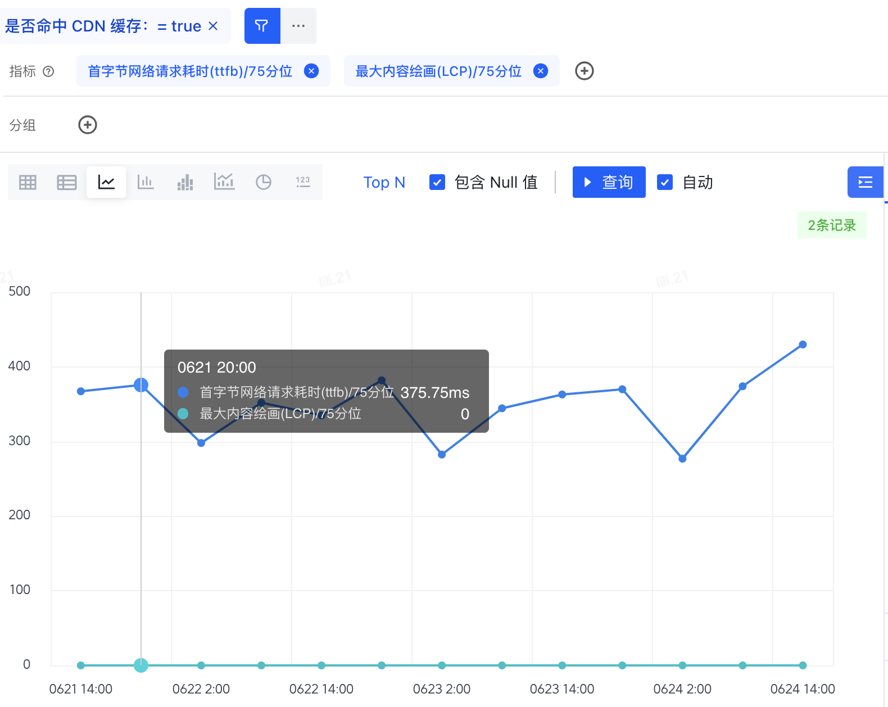
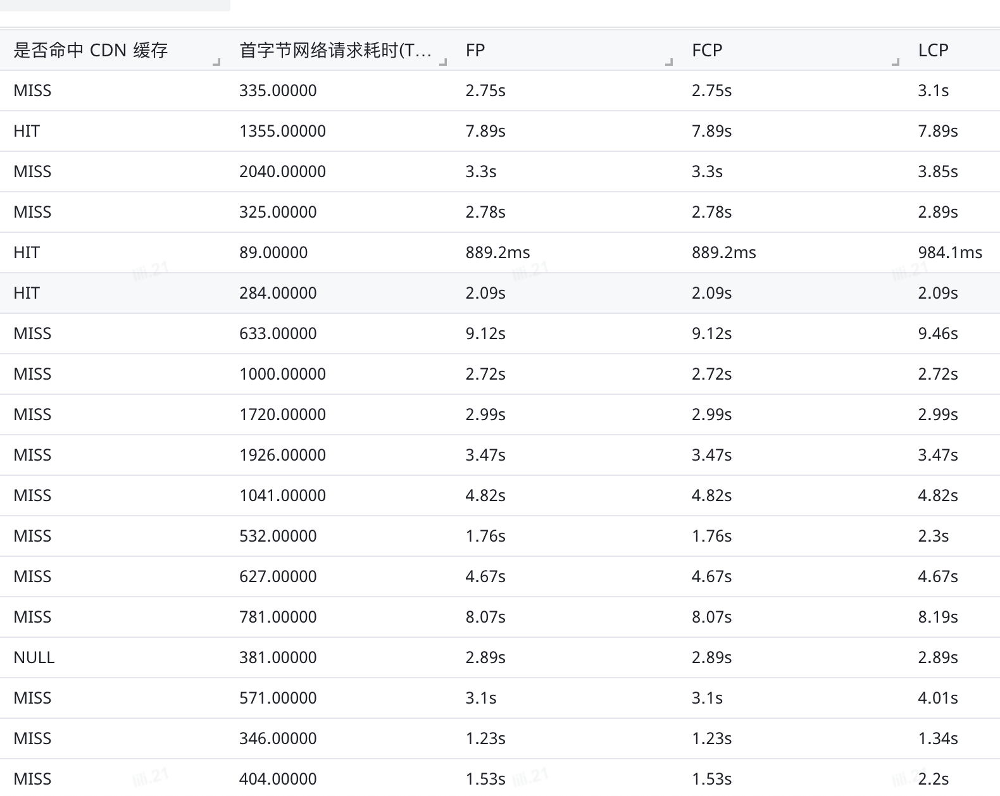
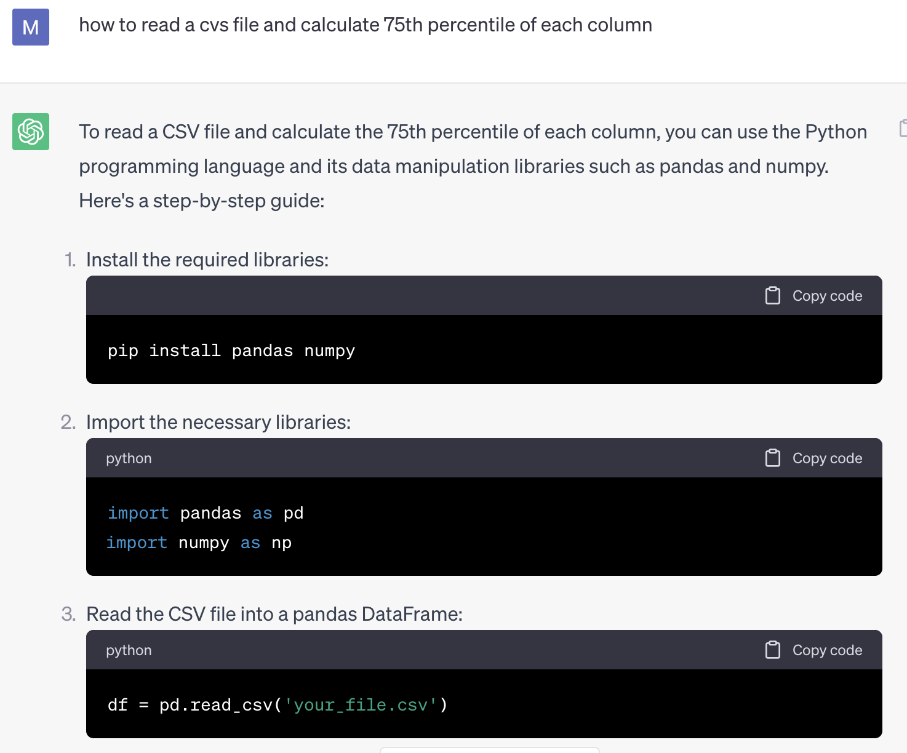
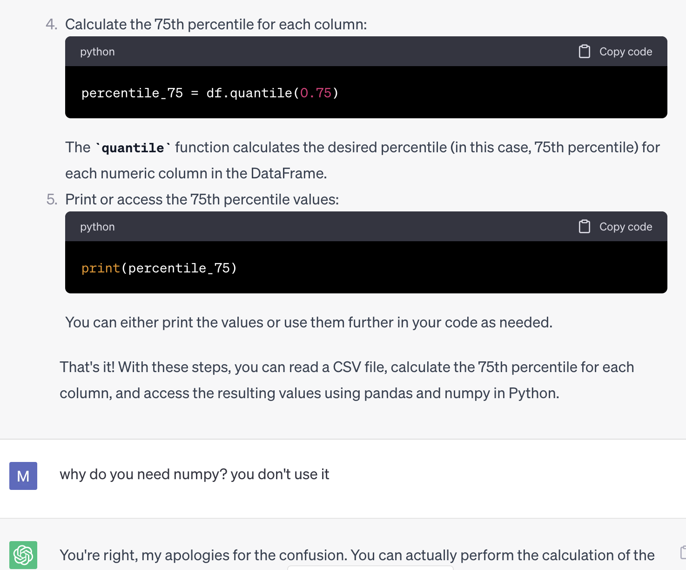
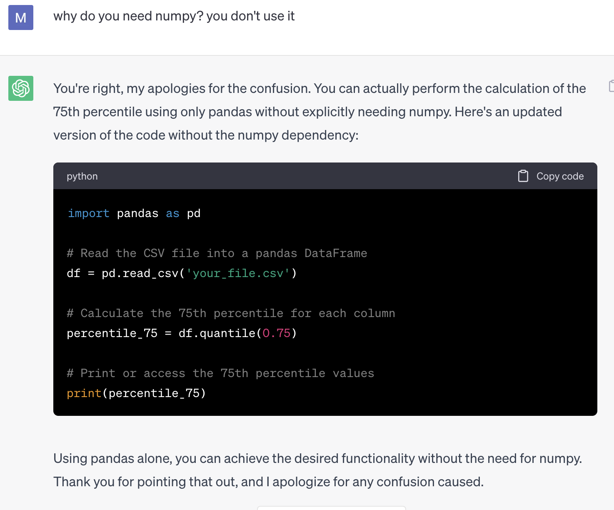
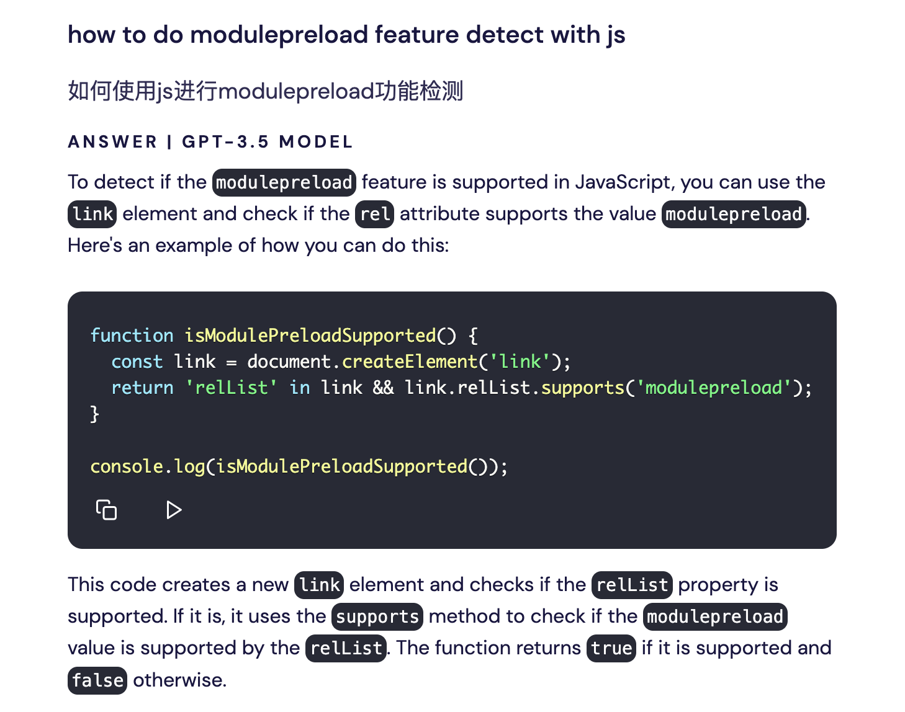

今天给大家分享两个我利用AI帮忙解决实际工作问题的例子


## 案例一，计算75分位LCP

最近我们上了一个性能优化方案，利用CDN缓存SSR返回的HTML，这样命中缓存的请求可以直接从CDN节点返回，可以极大的减少TTFB耗时。

从上线后的数据来看，也确实如此，从下图可以看出，命中缓存的TTFB 75分位只有300ms左右。



不过我们还想看命中缓存的LCP 75分位数据，可是从上图可以看出，这个数据是0。

咨询过相关同学了解到，「是否命中CDN缓存」这个属性只上报TTFB数据有加，LCP数据并没有这个属性，所以加上这个筛选条件后数据为0。

不过你可以把源数据下载下来（CSV格式），然后自己计算这个指标。



这方面我可没什么经验，如果按照传统做法，我肯定是google一下NodeJS怎么读CVS文件，然后再google一下怎么计算75分位。这一次来试试ChatGPT吧





以下就是ChatGPT给的代码，而我最终也用这段代码计算出了我想要的数据

```python
import pandas as pd

# Read the CSV file into a pandas DataFrame
df = pd.read_csv('your_file.csv')

# Calculate the 75th percentile for each column
percentile_75 = df.quantile(0.75)

# Print or access the 75th percentile values
print(percentile_75)
```

## 案例二，modulepreload特性检测

Remix框架是用es module来加载JS文件的

```html
<script type="modile">
  import "/build/manifest-93FD8568.js";
  import * as route0 from "/build/root-VHJ7ENMD.js";
  import * as route1 from "/build/routes/docs/$lang.$ref-W6FTIE6M.js";
  import * as route2 from "/build/routes/docs/$lang.$ref/index-536YLBTN.js";
  window.__remixRouteModules = {"root":route0,"routes/docs/$lang.$ref":route1,"routes/docs/$lang.$ref/index":route2};

  import("/build/entry.client-YUGSKNAS.js");
</script>
```

同时使用 _`modulepreload`_ 来提前加载JS

```html
<link rel="modulepreload" href="/build/manifest-93FD8568.js">
<link rel="modulepreload" href="/build/entry.client-YUGSKNAS.js">
<link rel="modulepreload" href="/build/_shared/chunk-4T7MF43V.js">
...
```

但是从[caniuse](https://caniuse.com/?search=modulepreload)的数据看，支持率并不是非常好。所以我想自己统计一下数据，看看对于我们的用户，支持率是怎样的。那怎么判定用户是否支持 _`modulepreload`_ 呢？

这里我用的是[phind](www.phind.com)，一个面向开发者的AI搜索引擎。相比于ChatGPT有两个优势

1. 不需要注册账号，对于国内用户，注册ChatGPT还是比较麻烦的
2. 会爬取最新的数据来回答问题。而ChatGPT免费版本只有2021年前的数据

来看一下效果如何



很快的找到了答案。我们对比一下google的搜索结果


一整页也没有看到我们想要的答案。

## 结论

从上面两个实际的例子可以看到，AI可以极大的缩短我们获取信息，咨询的路径，极大的提升我们的效率。不过AI提供的信息也不一定准确，需要你自己辨别和验证。

从ChatGPT面世以来，AI，大模型可以说非常的火热，程序员们也担心自己工作是不是要丢了。我个人的建议是，与其担心被替代，不如拥抱变化，把AI变成自己的好帮手，成为一个更好的程序员
