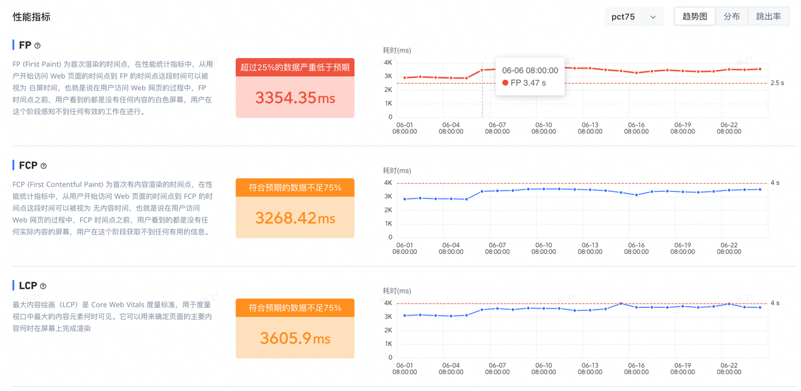
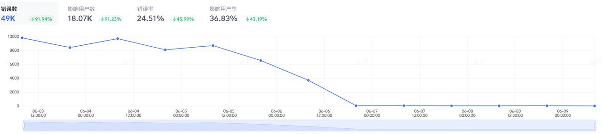
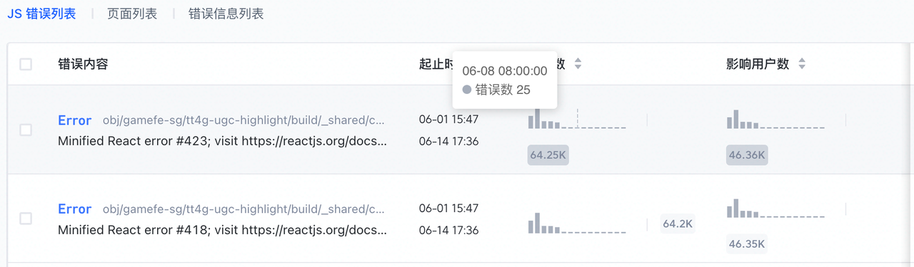
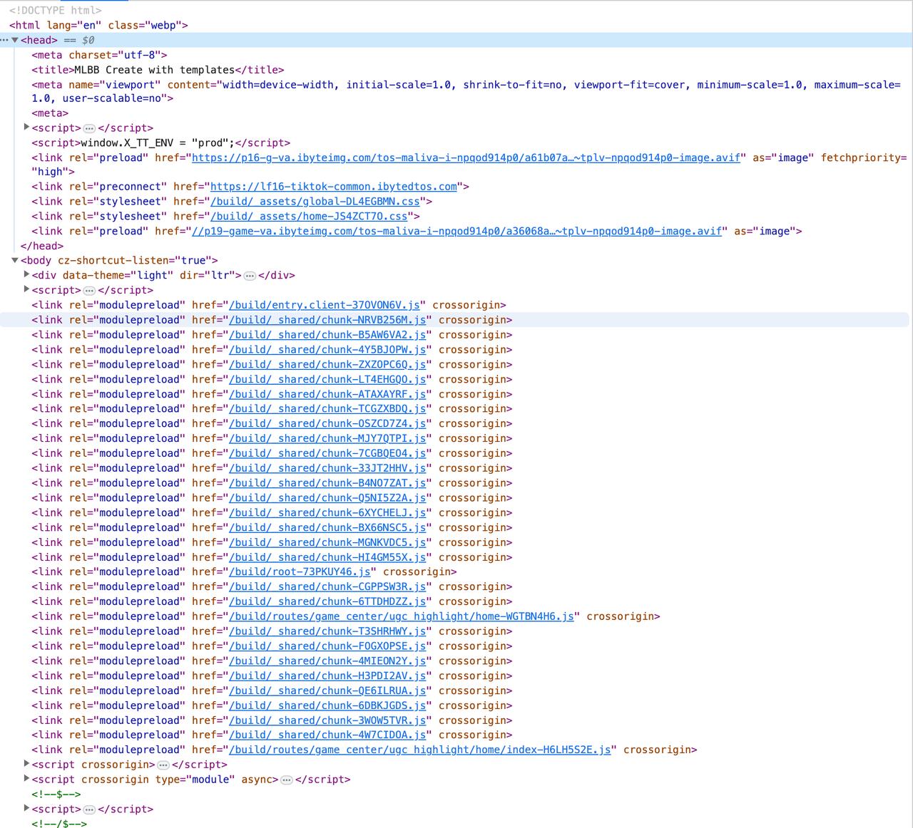
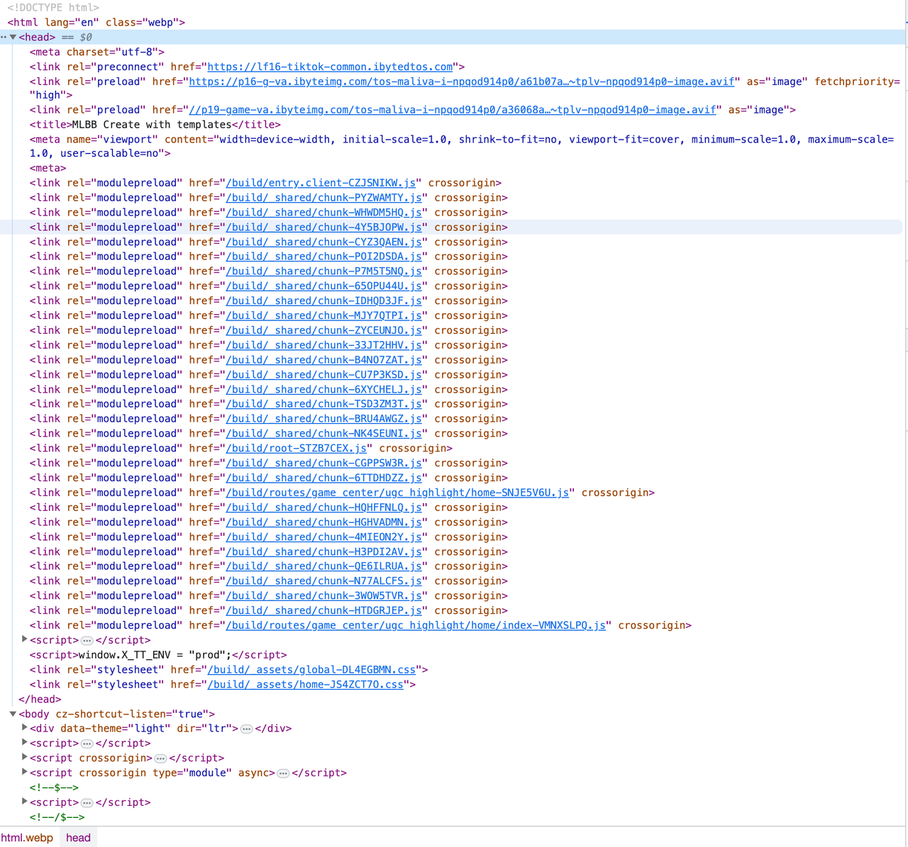
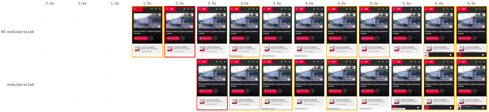
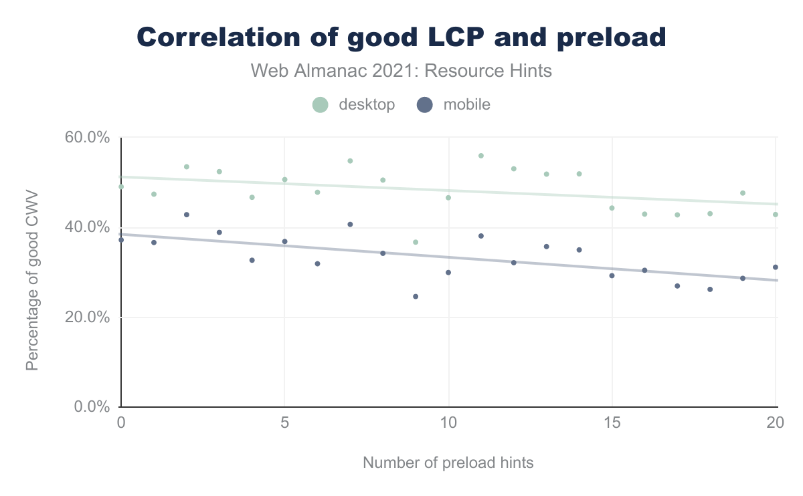
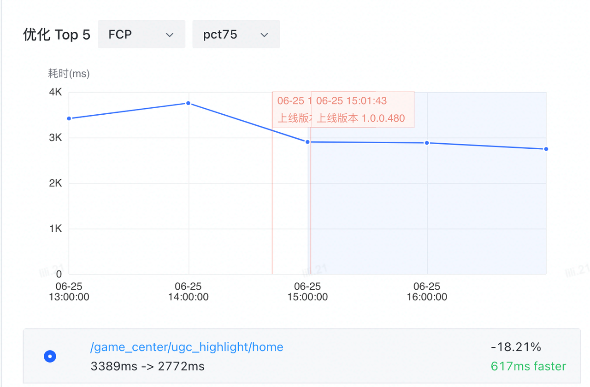
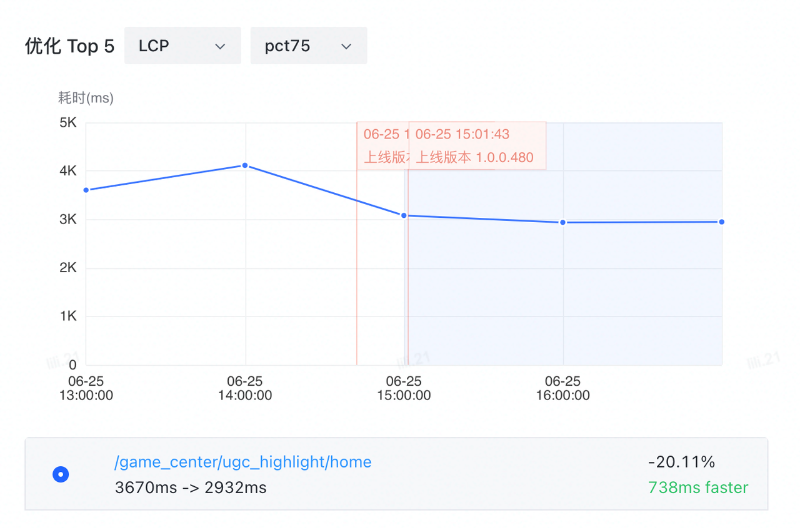

## 现象 - 性能劣化

最近一段时间在排查项目的性能指标，发现有个项目性能指标变差了。把时间拉长来看

指标都是在06-06之后开始变差了。看了下项目的发版记录，确实在06-06发过一个版本。找到MR仔细分析，就是正常的业务需求代码，代码逻辑层面并没有会影响到性能的改动。 不过这个MR里把react从18.2.0升级到了canary版本。难道是这个原因？

## 背景 - 为什么升级到canary版本

为了解决Hydration error的问题。可以参考这个[issue](https://github.com/facebook/react/issues/24430)
由于我们的项目是运行在TikTok Webview内的，TikTok Webview在启动的时候会在HTML插入一段<script/>标签，就会导致服务端返回的HTML，与客户端的实际的HTML不匹配，就会导致Hydration报错。这会导致两个问题

1. 可能会导致FOUC，影响用户体验
2. JS错误监控都是hydartion error相关的错，导致其他错误被隐藏，不好排查

升级到react@canary后

升级到canary版本后，JS错误数减少了99%，hydration相关的错也几乎消失了。

## 原因 - 那为什么会导致性能劣化？

我们比较一下两个版本的输出的HTML

**react@18.2.0**

**react@canary**

**react@canary**版本把 _`moduleprelaod`_ 都被移到 _`<head>`_标签里了。难道是这个原因？Google一下后确实发现两个相关的issue
- [Option to disable modulepreload](https://github.com/vitejs/vite/issues/5120)
- [Opt-in / opt-out of module preloading](https://github.com/vitejs/vite/issues/5991)

从第二个[issue](https://github.com/vitejs/vite/issues/5991)中的用户提供的数据可以看到，使用 _`modulepreload`_ 后首屏耗时增加了1s

从这个[httparchive](https://almanac.httparchive.org/en/2021/resource-hints#correlation-with-core-web-vitals)的统计数据里也能看出来，preload hints越多，core web vitas指标就越差

**原因在于过多的preload hints，就可能抢占网络资源，从而导致核心资源的加载时机被延迟，影响核心资源的加载速度，从而影响页面的核心性能指标。**

以我们的项目为例， _`module preload`_ 都被移到 _`<head>`_ 标签中，且都排在样式前面。就会推迟样式完成加载的时间，而样式资源是阻塞页面渲染的，也就导致整个页面的渲染时间被推迟了。首屏性能就会变差

## 解决方案 - 降级到18.2.0

降级后效果明显，LCP pct75下降了20%

针对这个问题，我也分别给react和remix建了issue
- [react issue](https://github.com/facebook/react/issues/26705)
- [remix issue](https://github.com/remix-run/remix/discussions/6685)

至于Hydration报错的问题，暂时需要找一个新的方案来处理了

