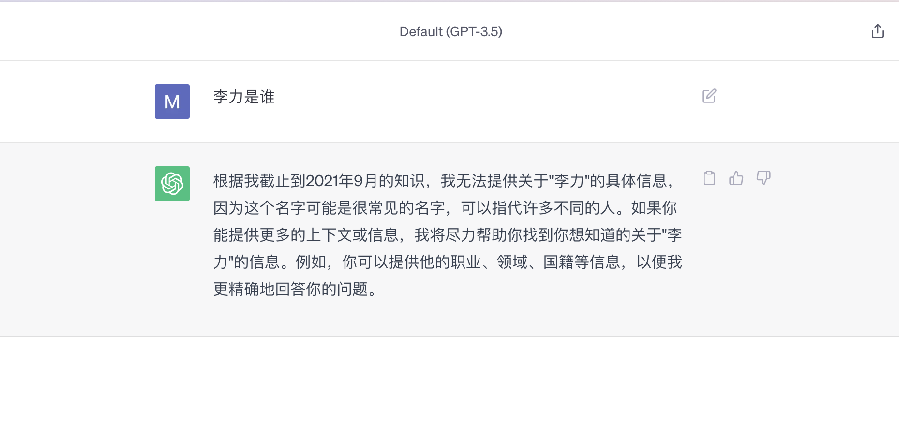
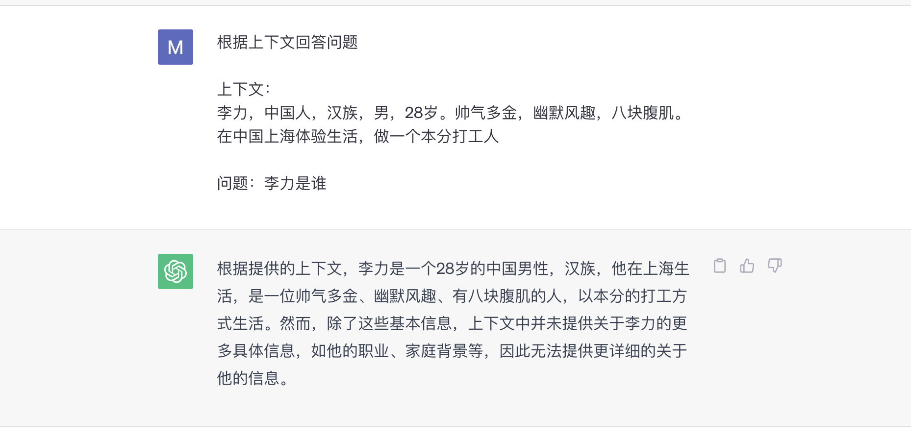
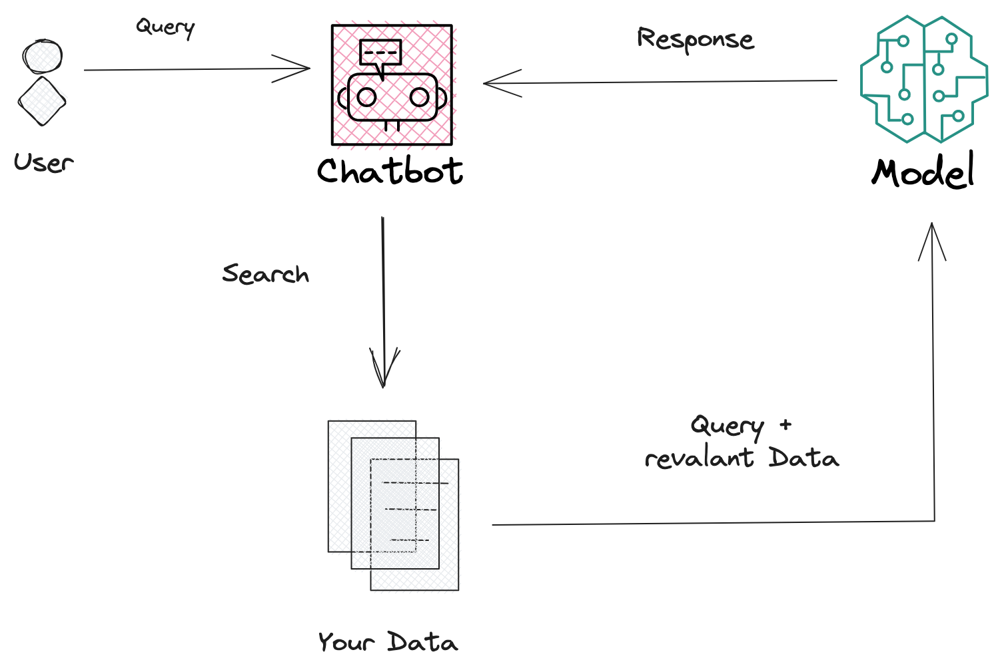

使用过ChatGPT或类似产品的同学们应该都会有类似的经历，某些问题的回答质量不高，要么就是不知道，要么就是回答的内容已经过时了。这是因为这些大模型都是预训练好的模型，预训练 - 就意味着数据集是有限的，他只知道训练他所用的数据。比如ChatGPT，使用的就是2021年9月之前的网络上部分数据。如果你问他2023年发生的事情，他肯定无法回答准确。另外还有一些特定领域的数据，或者非公开的数据，他也无法回答的很准确。

不过最近一段时间，大家应该能经常看到 chat pdf，chat doc，chat website这样的应用。那这些应用是怎么实现的呢？为什么他们可以和预训练之外的数据 - pdf，website 聊天呢？今天给大家分享一下我是如何实现[chat with remix](https://chat-remixdocs.vercel.app/)的，来讲解一下背后的原理


## Chat With Remix

从我过往的博客记录也能看到，我很喜欢Remix这个框架，也是这个框架的深度用户，在使用的过程难免需要查一查文档。[Remix文档](http://remix.run/docs/en/main)写的还是非常好的，但每次要找的自己想要的内容，还是要花一些功夫的

- 通过关键字搜索文档
- 根据搜索结果列表，打开相关文档链接
- 快速查看文档内容，自己从文档中找寻答案

搜索帮我减少了我需要查阅文档的数量，但要从这些文档中找到答案，还是不够高效。有没有可能做成ChatGPT一样的交互呢？我直接问问题，大模型告诉我答案岂不是更好？既然市面上还没有一个这样的产品，那我们就自己实现一个吧

## 原理简介

我们来看一个简单的例子



如果我直接ChatGPT问「李力是谁」，他是无法回答的



但如果我在Prompt里提供上下文，再问相关的问题，他就可以正确回答了。那我把Remix文档放上下文里不就行了？

简单来讲是的，只要我们把Remix文档放在Prompt里，并做一些Prompt优化，就可以实现我们的需求了。可是Remix整个文档很大，而大模型对于Token也就是我们发送消息的大小是有限制的，同时也是根据Token来收费的，把整个文档都放在Prompt里显然不现实，也不合理。

那根据用户的提问，找到Remix文档里最相关的内容，把这些内容放在Prompt里不就解决了吗？整个流程大致如下



那关键就在于如何根据用户的Query，找到Remix文档中最相关的内容

## 如何实现Remix文档的检索

常规的做法就是利用Embedding和Vector Database做相识检索

### Embedding

Embedding是NLP领域常见的技术手段，是为了将文本，图片，音视频等信息转换为向量这种算法和大模型更能理解和处理的数据格式

Embedding也有不同的模型，比如OpenAi提供的 _`text-embedding-ada-002`_ 模型。使用方法如下

```js
import OpenAI from 'openai'

const openai = new OpenAI({
  apiKey: process.env.OPENAI_API_KEY
})

const embeddingResponse = await openai.embeddings.create({
  model: 'text-embedding-ada-002',
  input: 'the text',
})
```

Remix文档包含近100分MDX文件，文件内容有大有小。最简单的方法是以文件粒度做Embedding，但这样显然是不合理的

- 无论的Embedding，还是和OpenAI交互时，Token大小都有限制
- Embedding包含的内容过多，就可能导致检索效果差，不准确等问题

这里就涉及到 _`Data Splitting`_ - 我们应该把每份MDX文件，切分成更小的粒度，然后再做Embedding。不同的内容，_`Splitting`_ 的策略都会有差异，甚至要多次调试，根据最终效果来确认最佳的策略。针对Remix文档MDX文件，我们可以简单的以段落作切分

```js
import { fromMarkdown } from 'mdast-util-from-markdown'
import { mdxFromMarkdown } from 'mdast-util-mdx'
import { toMarkdown } from 'mdast-util-to-markdown'
import { toString } from 'mdast-util-to-string'
import { mdxjs } from 'micromark-extension-mdxjs'
import { filter } from 'unist-util-filter'

function splitTreeBy(tree, predicate) {
  return tree.children.reduce((trees, node) => {
    const [lastTree] = trees.slice(-1)

    if (!lastTree || predicate(node)) {
      const tree = u('root', [node])
      return trees.concat(tree)
    }

    lastTree.children.push(node)
    return trees
  }, [])
}

function processMdxForSearch(content) {
  const mdxTree = fromMarkdown(content, {
    extensions: [mdxjs()],
    mdastExtensions: [mdxFromMarkdown()],
  })

  // Remove all MDX elements from markdown
  const mdTree = filter(
    mdxTree,
    (node) =>
      ![
        'mdxjsEsm',
        'mdxJsxFlowElement',
        'mdxJsxTextElement',
        'mdxFlowExpression',
        'mdxTextExpression',
      ].includes(node.type)
  )

  const sectionTrees = splitTreeBy(mdTree, (node) => node.type === 'heading')

  const sections = sectionTrees.map((tree) => {
    const [firstNode] = tree.children

    const heading = firstNode.type === 'heading' ? toString(firstNode) : undefined

    return {
      content: toMarkdown(tree),
      heading,
    }
  })

  return {
    sections,
  }
}
```

之后就可以对每个段落做Embedding

```js
for (const { slug, heading, content } of sections) {
  const input = content.replace(/\n/g, ' ')

  const embeddingResponse = await openai.embeddings.create({
    model: 'text-embedding-ada-002',
    input,
  })
}
```

### Vector Database - 向量数据库

通过Embedding，我们把Remix文档转换成向量后，就可以存储在向量数据库中。之后就可以Query在向量数据库中查找语义相似的内容。

向量数据库市面上也有很多，我们这里使用Supabase提供的向量数据库。如何用Supabase存储向量，以及查找语义相识的内容，Supabase有一篇详细的[教程](https://supabase.com/blog/openai-embeddings-postgres-vector)可以参考，这里不过多赘述。

数据库我了解的不多，这里只简单贴一下表的设计

```sql
// 存储每个文件的信息
create table "public"."nods_page" (
  id bigserial primary key,
  path text not null unique,
  type text,
  source text
);

// 存储每个段落的信息，包括embedding, token量，原始内容
create table "public"."nods_page_section" (
  id bigserial primary key,
  page_id bigint not null references public.nods_page on delete cascade,
  content text,
  token_count int,
  embedding vector(1536),
  heading text
);
```

创建好数据库后，我们就可以将上一步得到的Embedding结果存储进去

```js
const [responseData] = embeddingResponse.data

const { error: insertPageSectionError, data: pageSection } = await supabaseClient
  .from('nods_page_section')
  .insert({
    page_id: page.id,
    heading,
    content,
    token_count: embeddingResponse.usage.total_tokens,
    embedding: responseData.embedding,
  })
  .select()
  .limit(1)
  .single()

if (insertPageSectionError) {
  throw insertPageSectionError
}
```

## 最终实现

实现了Remix文档的检索，接下来我们只需要按照这个流程


实现我们的逻辑即可

```js
// 使用Embedding将用户的Query转成向量
const embeddingResponse = await openai.embeddings.create({
  model: 'text-embedding-ada-002',
  input: query.replaceAll('\n', ' '),
})

const {
  data: [{ embedding }],
} = embeddingResponse

// 然后通过向量数据库，查找语义相似的内容，即完成了Remix文档的检索
const { error: matchError, data: pageSections } = await supabaseClient.rpc(
  'match_page_sections',
  {
    embedding,
    match_threshold: 0.78,
    match_count: 10,
    min_content_length: 50,
  }
)

// 最后构造prompt，将上一步获得的内容作为上下文，调用OpenAI

let contextText = ''

for (let i = 0; i < pageSections.length; i++) {
  const pageSection = pageSections[i]
  const content = pageSection.content

  contextText += `${content.trim()}\n---\n`
}

const prompt = `
  ${`
    You are a very enthusiastic Remix representative who loves
    to help people! Given the following sections from the Remix
    documentation, answer the question using only that information,
    outputted in markdown format. If you are unsure and the answer
    is not explicitly written in the documentation, say
    "Sorry, I don't know how to help with that."
  `}

  Context sections:
  ${contextText}

  Question: """
  ${query}
  """

  Answer as markdown (including related code snippets if available):
`

const response = await openai.chat.completions.create({
  model: 'gpt-3.5-turbo',
  messages: messages.concat({ role: 'user', content: prompt }),
  // max_tokens: 512,
  temperature: 0,
  stream: true,
})
```

最终效果可以参考[How can I have structured data in a form?](https://chat-remixdocs.vercel.app/share/04FYrGv)

## 结语

本文带大家简单过了一遍Chat With Your Data的原理和基本实现逻辑。这也基本就是  Retrieval-Augmented Generation （RAG） 的整个流程。除了RAG，还可以通过用特定数据集Finetuning大模型，来得到一个新的模型，也可以实现Chat With Your Data。这部分之后有相关实践后，也会输出总结文章

## 参考

-[chat with remix](https://chat-remixdocs.vercel.app)
- [https://blog.maximeheckel.com/posts/building-magical-ai-powered-semantic-search/](Building a magical AI-powered semantic search from scratch)
- [nextjs openai doc search template](https://github.com/supabase-community/nextjs-openai-doc-search)
- [ClippyGPT - How I Built Supabase’s OpenAI Doc Search (Embeddings)](https://www.youtube.com/watch?v=Yhtjd7yGGGA)
