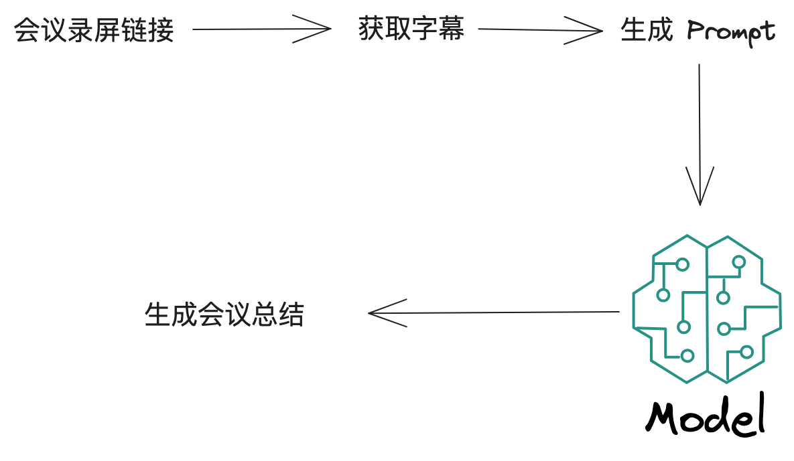
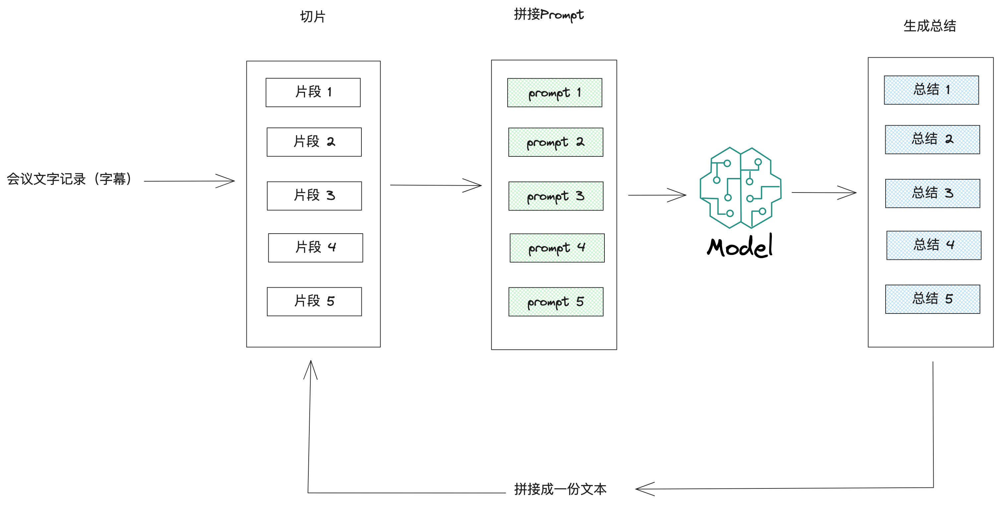

公司内部总是有很多技术分享的会议，但因为时间冲突无法参加。不过这些会议一般都会有录屏，也会自动生成文字记录（字幕）。可是这些会议一般都1h+，也很难空出时间从头听到尾。如果利用大模型的能力，可以自动生成会议总结，岂不美哉？

## 技术方案

整个流程如下图所示



## 难点 - Token限制

大模型都是有Token限制的，比如gpt-3.5-turbo的最大token量为4096。简单讲就是我们发给大模型的Prompt字符数是有数量限制的。而一场1h会议，字符数量量肯定是超出这个限制了

## 解决方案



如上所示，我们可以把会议的文字记录切分成一个个片段。然后对每一个片段，利用大模型生成总结。把生成的总结拼成一个新的文字记录，循环这个过程，直到最后只剩下一份总结。（有MapReduce那味了

## 实现 - LlamaIndex

LlamaIndex是一个专门用来处理数据，以供大模型消费的框架。它提供了各种方法来处理各种各样的数据，其中就包括我们需要的文本总结功能。整体实现代码如下所示

```ts
import {
  Document,
  SummaryIndex,
  TreeSummarize,
  ResponseSynthesizer
} from 'llamaindex'

const serviceContext = serviceContextFromDefaults()

const treeSummarizePrompt = ({ context, query }) => {
  return `会议内容如下.
---------------------
${context}
---------------------
根据以上会议内容, 回答以下问题.
问题: ${query}
回答:`
}

async function main() {
  // 获取会议文字记录
  const text = await getMeetingTranscript()

  const document = new Document({ text })

  const summaryIndex = await SummaryIndex.fromDocuments([document], {
    serviceContext
  })

  const queryEngine = summaryIndex.asQueryEngine({
    responseSynthesizer: new ResponseSynthesizer({
      serviceContext,
      responseBuilder: new TreeSummarize(serviceContext, treeSummarizePrompt)
    })
  })

  const response = await queryEngine.query('以中文输出不少于100字的会议总结文档')

  console.log(response)
}
```

## 代码讲解

### 第一步 - Data Ingest

```ts
const text = await getMeetingTranscript()

const document = new Document({ text })
```

从原始来源和格式中提取数据。这些数据来源可以是 API、本地文件、SQL 等等。[Llama Hub](https://llamahub.ai/)还提供了各种各样的loader，方便你来获取各种各样的数据，和LlamaIndex打通

比如[飞书文档loader](https://llamahub.ai/l/feishu_docs)

```python
from llama_index import download_loader

app_id="cli_slkdjalasdkjasd"
app_secret="dskLLdkasdjlasdKK"
doc_ids = ['HIH2dHv21ox9kVxjRuwc1W0jnkf']
FeishuDocsReader = download_loader('FeishuDocsReader')
loader = FeishuDocsReader(app_id, app_secret)
documents = loader.load_data(document_ids=doc_ids)
```

[youtube字幕loader](https://llamahub.ai/l/youtube_transcript)

```python
from llama_hub.youtube_transcript import YoutubeTranscriptReader

loader = YoutubeTranscriptReader()
documents = loader.load_data(ytlinks=['https://www.youtube.com/watch?v=i3OYlaoj-BM'])
```

**不过当前只有python支持，JS还不支持loader**

我们只需要获取到会议的文字记录，实例化Document就可以了

### 第二步 - Data Index

```ts
const summaryIndex = await SummaryIndex.fromDocuments([document], {
  serviceContext
})
```

数据索引，以中间表示形式构建数据，便于召回，搜索以及大模型消费。我们的场景是文本总结，所以使用了_`SummaryIndex`_。LlamaIndex还提供了 _`VectorStoreIndex`_ 来支持向量数据

### 第三步 - Engine

```ts
const queryEngine = summaryIndex.asQueryEngine({
  responseSynthesizer: new ResponseSynthesizer({
    serviceContext,
    responseBuilder: new TreeSummarize(serviceContext, treeSummarizePrompt)
  })
})
```

数据索引完成后，我们就可以以Engine的方式来调用大模型了。在这里我们可以自定义响应生成方式。我们这里用到了内置的 _`TreeSummarize`_ ，他就实现了我们上面讲的用来解决Token限制的方案，直接使用即可

### 最后一步 - 生成总结

```ts
const response = await queryEngine.query('以中文输出不少于100字的会议总结文档')
```

调用 _`query`_ 方法就会使用 _`treeSummarizePrompt`_ 模板生成最终的prompt，并调用大模型接口。最终返回数据

## 留两个问题读者

### 数据隐私

会议内容可能是涉密的，直接调用gpt-3.5这样的大模型可能不符合公司规定。能不能用私有模型呢？

### 流式输出

当前的 _`TreeSummarize`_ 响应是不支持流式的，而且我们需要多次调用大模型接口来获取最终的总结，耗时是很长的。可不可以支持流式呢？
