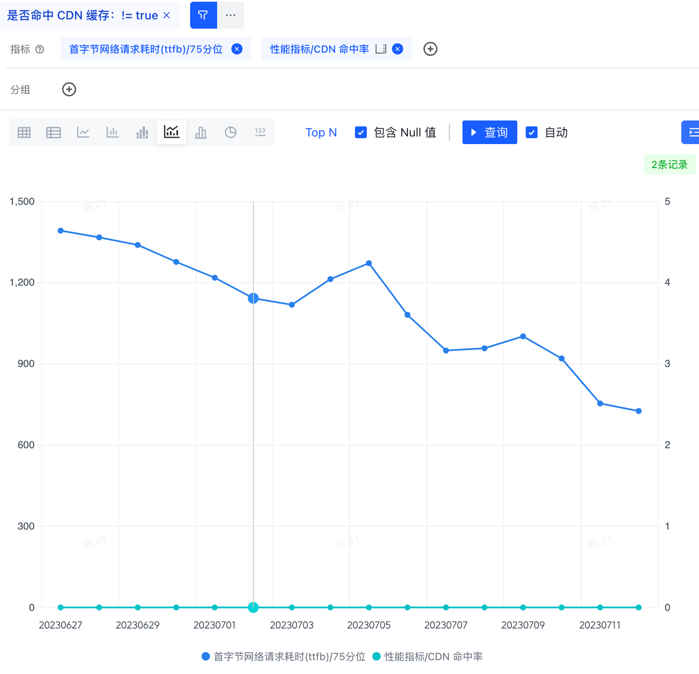
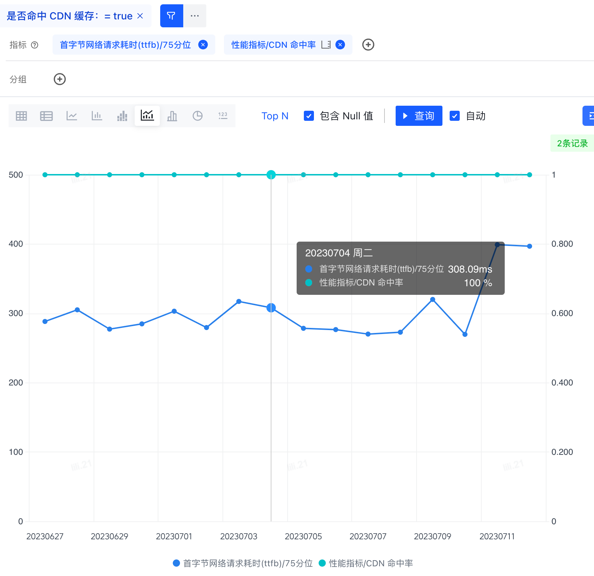

Remix是一个Server Frist框架，只提供SSR的能力，而没有提供像SSG,ISR这样的功能。但有些项目就是几乎纯静态的页面，比如下面这个页面


页面内容基本都是静态的，每个用户看到的也是一样的，每次访问都需要服务端渲染一次就不是很有必要了。有没有可能实现像SSG一样的效果呢？渲染一次，存下来，后续的访问都用缓存。


## Cache-Control

在[Remix实战系列 - HTTP缓存
](https://blog.lili21.me/posts/21)文章中，有详细介绍过如何在Remix中设置 _`Cache-Control`_ 。示例代码如下

```jsx routes/some-route.jsx

export function headers() {
  return {
    "Cache-Control": "max-age: 60"
  }
}

export default function SomeRoute() {
  return <div>some route page</div>
}

```

不过这是私有缓存，只会缓存在用户的浏览器上，只对当前用户的二次访问生效，对其他用户来说无效。能不能变成公有缓存呢？比如说缓存在CDN节点上？

## CDN缓存

一般来讲，用户通过域名访问我们的服务，是会经过一层CDN的。


从规范来讲，我们可以通过定义`s-maxage`来定义共享/公有缓存

```jsx routes/some-route.jsx

export function headers() {
  return {
    "Cache-Control": "max-age: 60"
  }
}

export default function SomeRoute() {
  return <div>some route page</div>
}

```

不过 _`s-maxage`_ 的问题在于，它是一个共享缓存，有可能被网络中任何一层代理缓存，而这些中间是不受我们控制的。不像CDN缓存，我们肯定希望这个缓存是受控的，这样在缓存有问题的情况下，我们可以手动清除它。

所以CDN厂商一般都会有自定义的响应头来实现缓存的设置，比如CloudFlare是通过 _`CDN-Cache-Control`_ 或 _`Cloudflare-CDN-Cache-Control`_ 响应头来控制的。Akamai则是可以通过 _`Edge-Control`_ 响应头来控制的。Akamai也可以通过配置开启遵循 _`Cache-Control`_ 响应头来控制缓存。

## Akamai CDN缓存实战

```jsx routes/some-route.jsx

export function headers() {
  return {
    "Edge-Control": "cache-maxage=30d"
  }
}

export default function SomeRoute() {
  return <div>some route page</div>
}

```

通过设置 _`"Edge-Control": "cache-maxage=30d"`_ 响应头，我们可以把SSR生成的HTML，在CDN中缓存30天了。只要有一个用户访问过我们的页面，这个缓存就会生成，后续其他用户访问都是直接走CDN缓存，不用再到我们的服务运行SSR了。是不是就类似SSG的效果呢?

### 问题 - 缓存命中率低

实际情况没有这么美好。maxage的意思是最多缓存多久，有可能这个缓存1天，1小时，甚至1分钟后就失效了。

原因在于，CDN节点的容量是有限的，CDN内部会有复杂的算法，来主动清除缓存。如果我们的页面访问量比较小，热度低，那很有可能我们的缓存生效时间很短，对于很多请求来讲，就不会有缓存了，也就没有了SSG的效果。

我们其中一个项目就只有不到5%的CDN缓存命中率，就没有SSG的效果了。所以只有在流量大，复访率高的页面里，这个缓存的收益才会大

### 问题 - 页面并不是100%静态的

比如我们开头提到的这个页面


**9.2K uses 849.0K views** 这段内容是动态的，其余部分都是静态的。那这部分数据怎么处理呢？

## ISR - Incremental Static Regeneration

如果我们在缓存的基础上，又可以动态的更新这个缓存，不是就完美了？也就实现了ISR的效果了。从规范上看，我们可以通过 _`stale-while-revalidate`_ 来实现。

我们通过一个实际例子，来看这个指令的效果

```
Cache-Control: max-age=1, stale-while-revalidate=59
```

此设置意味着，如果在接下来的 1 秒内重复该请求，则直接从缓存读取。
如果请求在 1 到 60 秒后重复，也从缓存读取。同时，“在后台”，将发出重新验证请求，以使用新值填充缓存以供将来使用。
如果请求在超过 60 秒后重复，缓存过期，则直接从网络中获取响应。

这就是动静结合了，**9.2K uses 849.0K views** 这段内容虽然是动态的，但实时性要求并不高。我们完全可以设置这样一个 `Cache-Control`

```
Cache-Control: max-age=60, stale-while-revalidate=31536000
```

60s内，直接读取缓存。60s后，也从缓存取值返回，但同时更新缓存，这样后续的请求就可以获取到更新的数据了。也就是实现了ISR的效果

## 问题 - Akamai不支持

目前很多CDN厂商已经支持了 _`stale-while-revalidate`_ 。比如Cloudflare, KeyCDN, Fastly。可惜的是 Akamai 不支持，我们没法直接用这个方案来实现ISR效果

目前唯一的解决方案就是把这部分数据的获取逻辑，从 SSR 里移出来，放到CSR里

## 效果

**未命中CDN缓存 TTFB**


**命中CDN缓存 TTFB**



从线上监控可以看到，命中CDN缓存的TTFB 75分位在300ms左右，相比未命中缓存的TTFB，减少了1s左右，减少70%+。效果非常明显

## 未来展望

上面我们提到，动态的数据获取逻辑需要从SSR里移除来，到CSR里做。描述起来轻描淡写，但实际做起来是有蛮多工作量和细节的。好消息是Remix在2.4.0版本里支持了[Client Data](https://github.com/remix-run/remix/discussions/7634)，提供了官方的方式在客户端获取数据，后续做类似的事情就会简单多了

另外，针对这种动静结合的页面，NextJS提出的 PPR - Partial Prerendering 方案，看起来非常的solid。这个是[demo](https://www.partialprerendering.com/)，可以体验下。但目前这个方案还是试验阶段，而且和Vercel的基建是深度绑定的。不过这个思路还是很有意思的，有机会可以试一下
