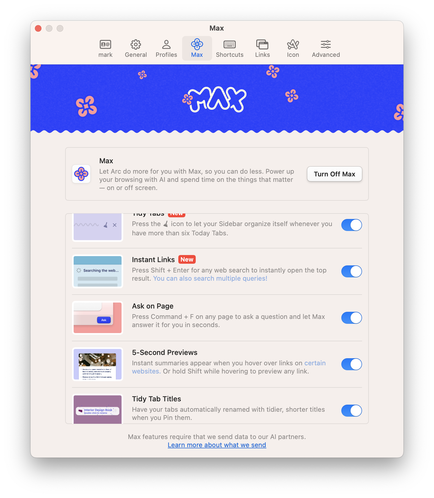
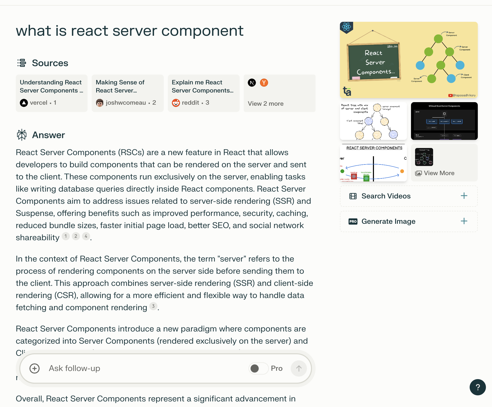

随着ChatGPT的发布，AI在2023年可以说是绝对的热点，这一年也有很多AI相关的模型，产品问世。笔者本人对此很感兴趣，工作也和AI，大模型有一些关系。在过去的一年体验了蛮多相关产品的，在平常的生活工作中也体会到了AI带来的便利和优势。所以在这里介绍几款个人认为非常好用的产品给大家

## Terminal - Warp

终端是每个程序员必不可少的工具了。Mac上大家可能很少用系统自带的终端，可能大部分都会用iterm。
这里给大家介绍一款更现代，结合AI能力的终端 - [Warp](warp.dev)。

大家平常工作中或多或少都需要用到一些终端指令，但却经常记不住。比如获取IP地址，如何回退上一次的git commit，但保留更改等。这种时候我们都需要到搜索引擎上搜索结果，然后复制粘贴到终端里。

而[Warp](warp.dev)自身集成了AI的能力，你可以直接在终端里通过和AI对话的方式，获得你想要的指令，并一键执行。

## 浏览器 - Arc

[Arc](https://arc.net/)浏览器真的很好用，用户体验真的一流。而Arc本身有集成了很多AI的能力，更是让他成为我的浏览器第一选择。

上图是Arc Max也就是Arc提供的AI能力一览。非常好用的是 Ask on Page 和 5-Seconds Preview。Ask on Page基本就替代了Chrome上很多Chat with website的插件了，而且这些AI能力都是免费使用的。同时这些AI能力也一直在扩展中

## 搜索引擎 - Perplexity

没有Google，我估计都要失业了。不过虽然google很好用，基本上第一页的搜索结果就能找到我要的内容。但可能还需要我一个个链接去看里面详细的内容，从中找到我想要的答案。

而这正式ChatGPT这类产品的优势，可以通过问答的方式直接告诉我答案，而不是给我一堆相关链接让我自己去找。

不过大模型的劣势在于他了解的信息，知识，数据是滞后的，并不是最新的，实时的。而这些又正式搜素引擎的优势

[Perplexity](https://www.perplexity.ai/)可以说是结合了这两点优势，既有实时的信息，又有大模型的总结能力。同时Perplexity还会给出回答这个问题的相关引用链接，当你对模型的回答不太满意时，你也可以查看相关的链接，自己寻找答案

