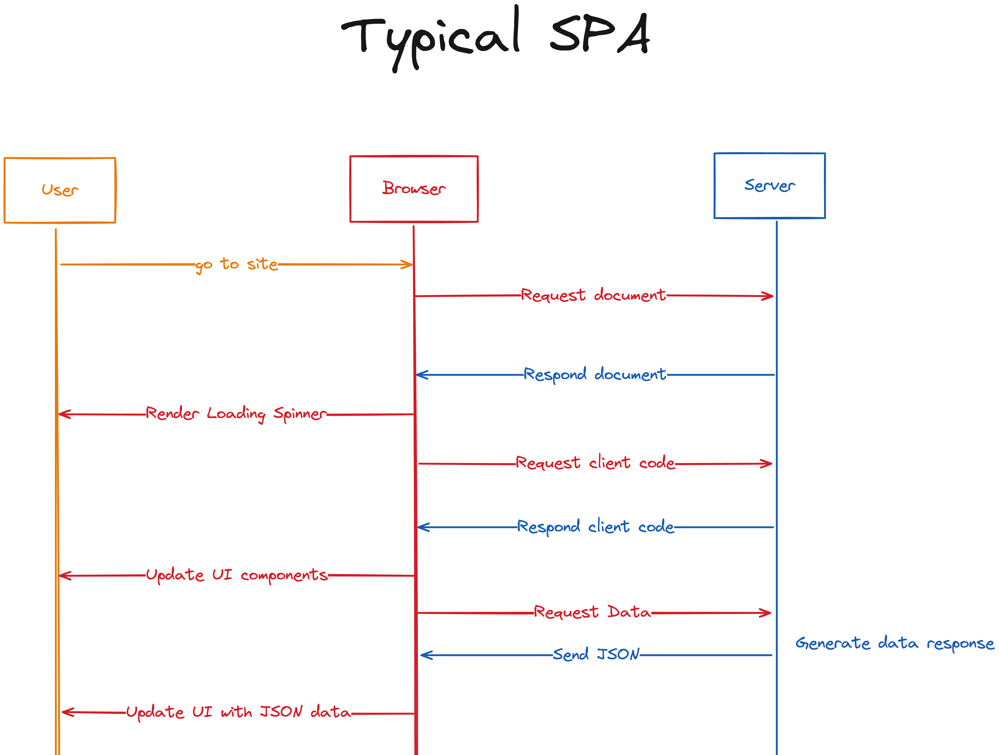
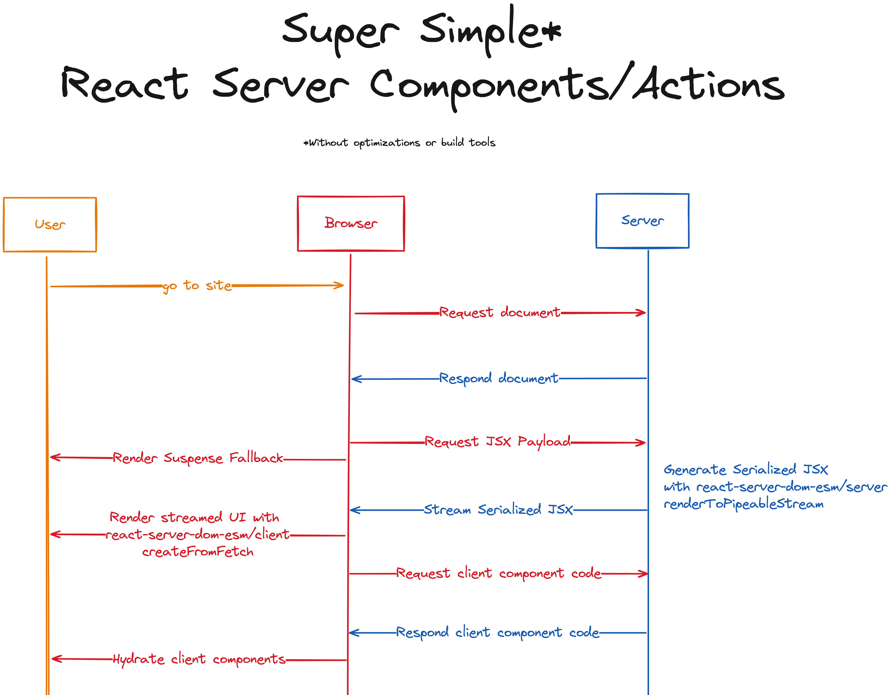

在上一篇中我们搭建了一个简单的SPA项目，可以用下图来描述整个页面的加载过程



从上图上可以发现两个问题

- Waterfall问题 - 加载完组件代码后，才开始请求接口数据
- 组件代码加载问题 - 我们的组件是存静态的，浏览器完全没必要加载这些组件

RSC可以解决上述两个问题。把组件放到服务端生成，我们将发送到客户端的JavaScript减少到仅包含交互部分，同时还能直接从组件中获取数据。

RSC的理念在概念上很简单。与其请求JSON数据并将其交给我们的组件来生成UI，我们直接请求UI本身。

# RSC

要在服务端实现RSC，我们需要使用到 _`react-server-dom-esm/server`_ 提供的 _`renderToPipeableStream`_ 方法来生成序列化的JSX数据，并在浏览器中进行渲染。

## react-server

需要注意的是，在RSC中，是不能使用 _`useEffect`_, _`useState`_ 等hook的。如果不小心处理，这可能会导致问题。这就是为什么React提供了一个特殊的版本给RSC使用，这样就可以避免这个错误。那如何使用这个版本呢？只需要在启动服务时添加 _`--conditions=react-server`_ 参数即可

```sh
node --watch --conditions=react-server server/app.js
```

这样Node就会使用RSC版本的React相关的包。

## 组件改造

准备就绪，我们就可以把组件改造成RSC

```jsx src/BandList.jsx
import React from "react";
import { getBandList } from "../server/db/band-api.js";

export async function BandList() {
  const bandList = await getBandList();
  return (
    <ul>
      {bandList.map((band) => (
        <li key={band}>{band}</li>
      ))}
    </ul>
  );
}
```

由于组件在服务端运行，我们可以直接使用 _`async/await`_ 获取数据。组建代码干净整洁了很多

## rsc接口

接来下实现一个 _`/rsc`_ 接口，返回序列化后的JSX数据

```js server/app.js
import { createElement } from "react";
import { renderToPipeableStream } from "react-server-dom-esm/server";
import App from "../dist/App.js";

app.get("/rsc", async (req, res) => {
  const { pipe } = renderToPipeableStream(createElement(App));
  pipe(res);
});
```

## RSC fomat

我们可以尝试访问一下rsc接口 `http://localhost:3000/rsc`，返回的数据格式如下

```json
0:D{"name":"App","env":"Server"}
1:D{"name":"BandList","env":"Server"}
0:["$","div",null,{"children":[["$","h1",null,{"children":"喜爱的乐队"}],"$L1"]}]
1:["$","ul",null,{"children":[["$","li","Coldplay",{"children":"Coldplay"}],["$","li","Radiohead",{"children":"Radiohead"}],["$","li","Maroon 5",{"children":"Maroon 5"}],["$","li","BTS",{"children":"BTS"}],["$","li","Blackpink",{"children":"Blackpink"}]]}]
```

你可以通过 [rsc-parser](https://rsc-parser.vercel.app/) 来更好的理解这个格式。这里我们不做深入探索

## 客户端渲染

拿到序列化后的JSX后，我们在客户端怎么渲染呢？使用 _`react-server-dom-esm/client`_ 提供的 _`createFromFetch`_ 方法即可

```jsx focus=3:11 src/index.jsx
import React, { startTransition, use } from "react";
import { createRoot } from "react-dom/client";
import { createFromFetch } from "react-server-dom-esm/client";

const initialContentFetchPromise = fetch(`/rsc`);
const initialContentPromise = createFromFetch(initialContentFetchPromise);

function Root() {
  const content = use(initialContentPromise);
  return content;
}

startTransition(() => {
  const root = createRoot(document.getElementById("root"));
  root.render(
    <div>
      <Root />
    </div>,
  );
});
```

注意，我们需要更新下 _`public/index.html`_ 里声明的import map。添加上 _`react-server-dom-esm/client`_ 的声明

## Streaming

我们还可以结合 _`Suspense`_，来实现Streaming的效果。只需要在 _`<BandList />`_ 组件外包一层 _`Suspense`_ 即可。

```jsx focus=7:9 src/App.jsx
import React, { Suspense } from "react";
import { BandList } from "./BandList.js";

export default function App() {
  return (
    <div>
      <h1>喜爱的乐队</h1>
      <Suspense fallback={<div>loading...</div>}>
        <BandList />
      </Suspense>
    </div>
  );
}
```

## 总结

到这一步，我们使用RSC实现一样的功能，我们同样用一张图来描述整个页面的加载过程



通过比较两个版本的网络请求可以看出，RSC解决了我们开头提出的两个问题

- Waterfall问题 - 组件在服务端渲染，没有client-server waterfall问题
- 组件代码加载问题 - App，BandList组件浏览器不再加载

具体的代码可以参考仓库 [https://github.com/lili21/rsc](https://github.com/lili21/rsc)
